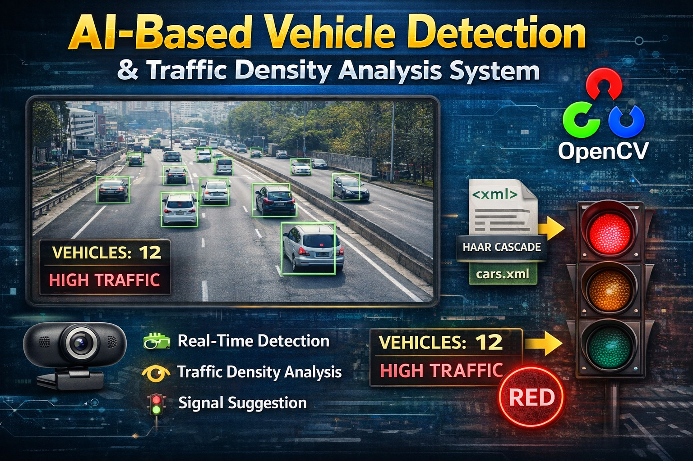

  

# 🚗 AI-Based Vehicle Detection & Traffic Density Analysis System

## 📌 Overview

This project is a real-time vehicle detection and traffic analysis system built using OpenCV and Haar Cascade Classifier. It detects vehicles from a live webcam feed and analyzes traffic density to suggest traffic signal status.

## 🎯 Features

* 🚘 Real-time vehicle detection using Haar Cascade
* 📹 Live webcam video processing
* 📊 Traffic density analysis
* 🚦 Traffic signal suggestion (RED / NO TRAFFIC)
* 🟥 Bounding box visualization
* 📈 Vehicle count display on screen

## 🛠️ Tech Stack

* Python
* OpenCV
* Haar Cascade Classifier
* Imutils

## 📂 Project Structure

AI-Vehicle-Detection-Traffic-Analysis/
│
├── models/
│   └── cars.xml
│
├── src/
│   └── main.py
│
├── requirements.txt
├── README.md
└── .gitignore

## ⚙️ Installation

1. Clone the repository:
   git clone https://github.com/selvan-01/AI-Vehicle-Detection-Traffic-Analysis.git
   cd AI-Vehicle-Detection-Traffic-Analysis

2. Install dependencies:
   pip install -r requirements.txt

## ▶️ How to Run

python src/main.py

## 🧠 How It Works

1. Captures live video from webcam
2. Converts frames to grayscale
3. Uses Haar Cascade (cars.xml) to detect vehicles
4. Draws bounding boxes around detected vehicles
5. Counts vehicles and analyzes traffic density
6. Displays traffic status on screen

## 🚦 Traffic Logic

* If vehicle count ≥ 8 → High Traffic (RED Signal)
* Else → Low Traffic

## 📸 Output

* Real-time video with vehicle detection
* Vehicle count displayed on screen
* Traffic status indication

## ⚠️ Limitations

* Haar Cascade is less accurate compared to modern models like YOLO
* Works best in controlled environments
* Limited detection accuracy in complex traffic scenes

## 🔥 Future Improvements

* Upgrade to YOLOv8 for better accuracy
* Add vehicle tracking (DeepSORT)
* Save output video
* Build dashboard for traffic analytics
* Deploy as web application

  ## 🔗 Links

- 💼 [LinkedIn](https://www.linkedin.com/in/senthamil45)
- 🌍 [Portfolio](https://senthamill.vercel.app/)
- 💻 [GitHub](https://github.com/selvan-01/AI-Vehicle-Detection-Traffic-Analysis.git)

## 👨‍💻 Author

S. Senthamil Selvan
Final Year CSE Student | AI & Data Enthusiast

## ⭐ Show Your Support

If you like this project, give it a star on GitHub!
